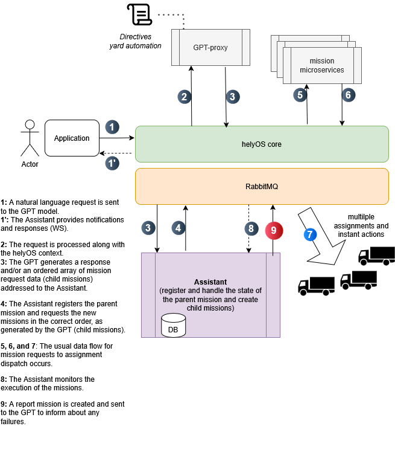

# Autonomous Driving Application with Large Language Model Reasoning

## Overview
This repository integrates the helyOS framework with GPT to create advanced autonomous driving applications that respond to natural language commands.

## Key Components
- **GPT-Proxy**: An HTTP microservice that connects to a large language model.
- **Assistant**: An AMQP service that dispatches and monitors requests generated by the GPT model.

## Benefits
- **Efficiency**: Reduces human intervention in organizing complex missions and handling failures.
- **Accessibility**: Provides a user-friendly interface with minimal training required.

## How to Run

Clone the repository: [https://github.com/helyOSFramework/logistics-center-demo](https://github.com/helyOSFramework/logistics-center-demo)

1. Substitute the `microservice.yml` and `mission.yml` files in `/settings/config/`.
2. Set the `control-tower-network` as external:

```bash
docker network create control-tower-network
```

3. Start the Logistics Center Demo.
4. Register the `gpt-assistant` in the HelyOS dashboard.( uuid=gpt-assistant,pass=secret_password)
5. Run `docker-compose` to spin up the Assistant and the GPT-Proxy microservice.
6. Open `http://localhost:3033` to access the GPT interface.

## Challenges
- **Cost and Privacy**: Replace GPT-4 with a self-hosted open-source smaller model.

## Diagram

